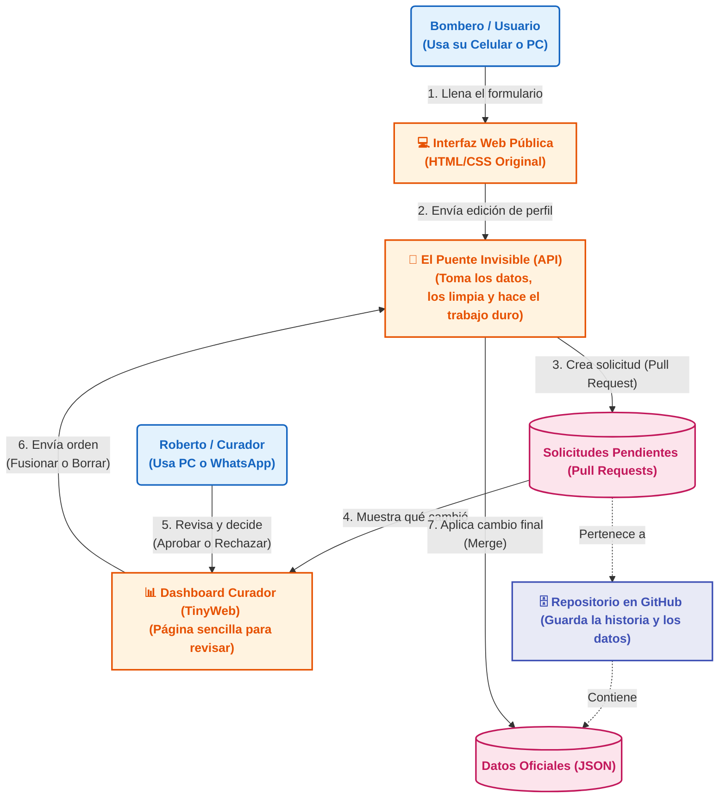

# ARQUITECTURA TÉCNICA Y DISEÑO: Marketplace Editable (Capa 2)

**Proyecto:** ERTC - Estructura Relacional del Trabajo Colectivo  
**Módulo:** Marketplace Editable (Capa 2)  
**Nivel de Diseño:** Propuesta Práctica de Implementación Profesional  

---

## 1. Arquitectura del Sistema: Conceptos en Simple

El diseño del sistema se basa en mantenerlo 100% gratuito de operar y sin bases de datos adicionales que mantener. Usamos a **GitHub como el gran archivador oficial** de la información.

### ¿Cómo funciona a grandes rasgos?
1. **El Frontend (La Pantalla del Celular/Web):** Es el HTML y CSS creado por Roberto. Es solo visual, no guarda datos.
2. **El Puente (Backend Invisible / Serverless):** Es un pequeño programa que está "dormido" en internet. Solo se despierta cuando alguien presiona "Enviar", toma el formulario de Roberto, se da la vuelta y habla con GitHub para que el cambio se suba. Hace el trabajo técnico que el bombero no tiene por qué saber hacer.
3. **El Libro Contable (GitHub):** Actúa como base de datos. Guarda los perfiles (en archivos de texto estructurado o JSON).
4. **La Pantalla de Curador (TinyWeb):** Es la página secreta donde Roberto verá (sin tecnicismos) lo que quiso cambiar el Bombero, dando el "Aprobar" o "Rechazar".

### Diagrama General de Arquitectura
*(Este diagrama muestra las 4 piezas encajando de forma amigable)*



---

## 2. Decisiones Técnicas sin Rodeos

En lugar de hablar de "Backend-for-Frontend" o "CQRS", defendemos esto así:

* **Separación Inteligente:** La página pública no se conecta a GitHub (para que nadie nos robe permisos). La página le envía un paquete al "Puente Invisible" y él hace los papeleos técnicos.
* **Todo Cambio es una 'Solicitud Formal':** (Pull Requests). En vez de que los datos cambien de golpe (y corramos riesgo de borrar perfiles), el servidor transforma el envío del usuario en un "Borrador de cambios" ("A Pedro le gustaría actualizar su teléfono"). Roberto evalúa esos borradores y si aprueba, se hacen oficiales.
* **Cero Servidores Reales:** Usaremos funciones gratuitas de internet (Vercel o similar) que solo corren el código al apretar el botón, ahorrando mantenimiento y servidores de $20 mensuales.

---

## 3. Estructura Limpia del Proyecto

Hay que organizar la carpeta actual sin romper nada. Queremos pasar de un "montón de archivos" a una casa ordenada para que sea fácil darle mantenimiento. Lo haremos sin alterar ningún color ni lógica de Roberto.

**Propuesta de Carpetas:**

```text
ERTC/
├── .github/          # Reglas automáticas para que GitHub valide que nada se rompa.
├── api/              # Aquí vivirá el código de nuestro "Puente Invisible".
├── docs/             # Explicaciones cómo este mismo archivo.
├── src/              # El corazón visual
│   ├── assets/       # Imágenes, iconos y colores (CSS).
│   ├── data/         # Los archivos JSON que contienen la información de perfiles.
│   └── pages/        # Los HTML públicos y el HTML del Curador.
└── index.html        # La puerta de entrada principal.
```

---

## 4. El Flujo Paso a Paso (Cómo suceden las cosas)

1. **El Bombero Edita:** Entra a la web, modifica su información y aprieta Enviar.
2. **El Sistema Empaqueta:** Nuestro "Puente invisible" recibe esa info, verifica que no falten datos, y se mete a GitHub creando una nueva rama aislada.
3. **El Sistema Notifica:** Le devolvemos un botón en pantalla al bombero que dice: "Avisarle a Roberto por WhatsApp". Si pulsa, abre su WhatsApp personal listito con el enlace para Roberto.
4. **Roberto Revisa:** Roberto pincha el enlace que le llegó por WhatsApp, abriendo su TinyWeb secreta. Ve un resumen muy claro: "Antes decía A, Ahora dice B".
5. **Roberto Decide:**
   - **Aprobar:** Si pulsa "Aprobar", nuestro Puente junta los cambios oficiales en GitHub, y se le da a Roberto un texto copiado: *"✅ Perfil aprobado"*.
   - **Rechazar:** Si pulsa "Rechazar", nuestro Puente anula el borrador y le da a Roberto el texto de rechazo copiado.
6. **Resolución Humana:** Roberto pega y le manda el texto de confirmación al WhatsApp del bombero.

*(Nota: En todo este flujo, jamás usamos la API de pago empresarial de WhatsApp, ni obligamos al bombero a entender plataformas para hackers como Github).*

---

## 5. Control de Calidad Mínimo y Profesional

Para asegurarnos de que la máquina no se descarrile sola, agregaremos pequeñas reglas automatizadas (`CI/CD Pipeline`):

* **El policía de la puerta:** Un pequeño bloque de código (Schema Validator) que se asegure de que ningún archivo que entre tenga letras extrañas en el mail o datos omitidos obligatorios. Si la data viene mal, el Puente la devueve.
* **Publicación Autónoma:** En cuanto Roberto presione "Aprobar" en un perfil, en vez de tener que ir nosotros a actualizar manualmente archivos, GitHub Pages/Vercel publicará la nueva versión a la web mundial en menos de 1 minuto, sola. Todo 100% automático.

---

Esta arquitectura es la ideal para que tu ERTC quede como un relojito suizo: es robusto, no cuesta dinero mantenerlo y la curva de aprendizaje para el bombero es cero. Es un puente directo entre usabilidad popular y rigor corporativo tras bambalinas.
